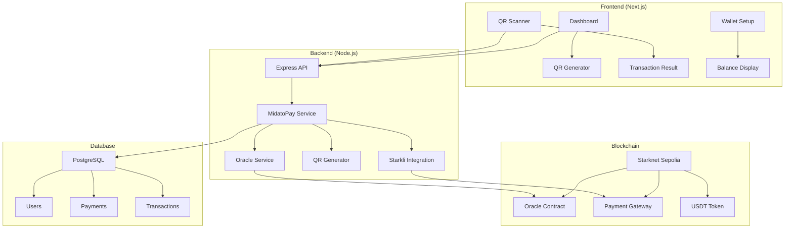

#  MidatoPay - Solución de Pagos Web3 para Comerciantes


**La primera wallet para comerciantes que permite cobrar con QR interoperable y recibir pagos directamente en criptomonedas**


## 📋 Tabla de Contenidos

- [🎯 Descripción del Proyecto](#-descripción-del-proyecto)
- [✨ Características Principales](#-características-principales)
- [🏗️ Arquitectura del Sistema](#️-arquitectura-del-sistema)
- [🔧 Tecnologías Utilizadas](#-tecnologías-utilizadas)
- [📦 Instalación y Configuración](#-instalación-y-configuración)
- [🚀 Flujo de Usuario Completo](#-flujo-de-usuario-completo)
- [💎 Contratos Cairo](#-contratos-cairo)
- [🔗 Integración con Starknet](#-integración-con-starknet)
- [📱 API Endpoints](#-api-endpoints)
- [🎨 Frontend Features](#-frontend-features)
- [🔐 Seguridad](#-seguridad)
- [📊 Base de Datos](#-base-de-datos)
- [🧪 Testing](#-testing)
- [🚀 Deployment](#-deployment)
- [👥 Equipo](#-equipo)
- [📄 Licencia](#-licencia)

## 🎯 Descripción del Proyecto

MidatoPay es una solución revolucionaria de pagos Web3 diseñada específicamente para comerciantes argentinos que buscan protegerse de la inflación. La plataforma permite a los comerciantes recibir pagos en criptomonedas (USDT, BTC, ETH) a través de códigos QR interoperables, mientras mantienen la simplicidad de uso de los pagos tradicionales.

### 🎪 Problema que Resuelve

- **Inflación Argentina**: Los comerciantes pierden valor de sus ingresos debido a la inflación
- **Barreras de Entrada**: Las soluciones crypto existentes son complejas para comerciantes tradicionales
- **Interoperabilidad**: Falta de estándares QR interoperables en el ecosistema crypto
- **Conversión de Monedas**: Dificultad para convertir ARS a crypto de manera eficiente

### 💡 Solución Propuesta

MidatoPay ofrece una plataforma completa que incluye:
- Wallet automática para comerciantes
- QR codes interoperables con estándar EMVCo TLV
- Oracle de precios en tiempo real (ARS ↔ USDT)
- Integración directa con Starknet
- Interfaz simple y familiar

## ✨ Características Principales

### 🛡️ Protección contra Inflación
- Conversión automática ARS → USDT usando Oracle de Starknet
- Precios en tiempo real actualizados cada 30 segundos
- Protección del valor de los ingresos del comerciante

### ⚡ Transacciones Instantáneas
- Integración directa con Starknet L2
- Confirmaciones rápidas (< 2 minutos)
- Gas fees mínimos comparado con Ethereum

### 🔗 QR Interoperable
- Estándar EMVCo TLV implementado
- Compatible con cualquier wallet que soporte el estándar
- Datos estructurados: merchant address, amount, payment ID

### 🎯 Experiencia de Usuario Simplificada
- Dashboard intuitivo para comerciantes
- Generación de QR con un click
- Escaneo fácil desde cualquier dispositivo
- Notificaciones en tiempo real

## 🏗️ Arquitectura del Sistema



## 🔧 Tecnologías Utilizadas

### Frontend
- **Next.js 14** - Framework React con App Router
- **TypeScript** - Tipado estático
- **Tailwind CSS** - Estilos utilitarios
- **Framer Motion** - Animaciones
- **React Hook Form** - Manejo de formularios
- **React Toastify** - Notificaciones

### Backend
- **Node.js** - Runtime de JavaScript
- **Express.js** - Framework web
- **Prisma** - ORM para base de datos
- **WebSocket** - Comunicación en tiempo real
- **Starkli** - CLI para Starknet

### Blockchain
- **Starknet Sepolia** - Red de prueba
- **Cairo** - Lenguaje de contratos inteligentes
- **OpenZeppelin** - Bibliotecas de contratos

### Base de Datos
- **PostgreSQL** - Base de datos relacional
- **Prisma Migrate** - Migraciones de esquema

## 📦 Instalación y Configuración

### Prerrequisitos
- Node.js 18+
- PostgreSQL 15+
- Git
- Starkli CLI


## 🚀 Flujo de Usuario Completo

### 1. 🏠 Página de Inicio
- Landing page con información del producto
- Call-to-action para registro
- Estadísticas y características principales

### 2. 🔐 Registro y Login
- **Registro**: Email, nombre, teléfono
- **Login**: Autenticación JWT
- **Roles**: MERCHANT, ADMIN

### 3. 💼 Dashboard del Comerciante
- **Vista general**: Estadísticas de ventas
- **Balance USDT**: Saldo actual en tiempo real
- **Historial**: Transacciones recientes

### 4. 🔑 Configuración de Wallet
- **Generar Wallet**: Creación automática de wallet Starknet
- **Importar Wallet**: Usar wallet existente
- **Verificar Balance**: Conexión con contrato USDT
- **Seguridad**: Encriptación de claves privadas

### 5. 💰 Gestión de Pagos
- **Agregar Monto**: Input de cantidad en ARS
- **Conversión Automática**: Oracle ARS → USDT
- **Generar QR**: Código QR interoperable
- **Compartir**: Enlace o imagen del QR

### 6. 📱 Escaneo de QR
- **Cámara**: Escaneo automático de QR
- **Validación**: Verificación de datos EMVCo TLV
- **Procesamiento**: Ejecución de transacción Starknet
- **Confirmación**: Hash y link a Starkscan

### 7. ✅ Resultado de Transacción
- **Estado**: Pendiente → Completado
- **Hash**: Enlace a explorador de blockchain
- **Detalles**: Monto, comercio, timestamp
- **Acciones**: Copiar hash, escanear otro QR

## 💎 Contratos Cairo

### Oracle de Precios (`starknetOracleService.js`)
```cairo
#[contract]
mod PriceOracle {
    use starknet::ContractAddress;
    use starknet::get_caller_address;
    
    #[storage]
    struct Storage {
        scale: u256,
        price_feed: ContractAddress,
    }
    
    #[external(v0)]
    fn quote_ars_to_usdt(ref self: ContractState, amount_ars: u256) -> u256 {
        // Implementación del Oracle
        let scaled_amount = amount_ars * self.scale.read();
        // Lógica de conversión ARS → USDT
    }
}
```

### Payment Gateway (`payment_gateway.cairo`)
```cairo
#[contract]
mod PaymentGateway {
    use starknet::ContractAddress;
    use starknet::get_caller_address;
    
    #[storage]
    struct Storage {
        admin: ContractAddress,
        usdt_token: ContractAddress,
    }
    
    #[external(v0)]
    fn pay(
        ref self: ContractState,
        merchant_address: ContractAddress,
        amount: u256,
        token_address: ContractAddress,
        payment_id: felt252
    ) {
        // Transferir USDT al merchant
        // Registrar transacción
        // Emitir evento
    }
}
```

### Características de los Contratos
- **Gas Optimizado**: Uso eficiente de storage y compute
- **Seguridad**: Validaciones y checks de seguridad
- **Escalabilidad**: Diseño para alto volumen de transacciones
- **Interoperabilidad**: Compatible con estándares ERC-20

## 🔗 Integración con Starknet

### Starkli CLI Integration
```javascript
// Ejecución automática de transacciones
const command = `starkli invoke ${contractAddress} pay ${merchantAddress} u256:${amount} ${tokenAddress} ${paymentId} --account ${accountPath} --keystore ${keystorePath} --keystore-password ${password} --network sepolia`;

const { stdout, stderr } = await execAsync(command, {
  timeout: 60000
});
```

### Características de la Integración
- **Transacciones Automáticas**: Ejecución sin intervención manual
- **Manejo de Errores**: Recuperación automática de errores
- **Dry-run**: Validación antes de ejecución real
- **Hash Extraction**: Extracción automática de transaction hash

### Redes Soportadas
- **Starknet Sepolia**: Red de pruebas (actual)
- **Starknet Mainnet**: Producción (futuro)

## 📱 API Endpoints

### Autenticación
```http
POST /api/auth/register
POST /api/auth/login
POST /api/auth/logout
```

### Usuario
```http
GET /api/users/profile
PUT /api/users/profile
POST /api/users/wallet/generate
POST /api/users/wallet/import
```

### Pagos
```http
POST /api/midatopay/generate-qr
POST /api/midatopay/scan-qr
GET /api/midatopay/history/:merchantId
GET /api/midatopay/stats/:merchantId
```

### Oracle
```http
GET /api/oracle/price/ars-usdt
GET /api/oracle/quote/:amount
```

### WebSocket
```javascript
// Conexión en tiempo real
const ws = new WebSocket('ws://localhost:3001/ws');
ws.onmessage = (event) => {
  const data = JSON.parse(event.data);
  // Actualizar UI en tiempo real
};
```

## 🎨 Frontend Features

### Componentes Principales
- **Dashboard**: Vista principal del comerciante
- **QRModal**: Generación y visualización de QR
- **WalletSetup**: Configuración de wallet
- **TransactionResult**: Resultado de transacciones
- **CustomHeader**: Navegación personalizada

### Hooks Personalizados
- **useOracleConversion**: Conversión ARS → USDT
- **useWebSocket**: Comunicación en tiempo real
- **useWalletManager**: Gestión de wallets

### Responsive Design
- **Mobile First**: Diseño optimizado para móviles
- **Tablet**: Adaptación para tablets
- **Desktop**: Experiencia completa en desktop

## 🔐 Seguridad

### Encriptación
- **Claves Privadas**: Encriptadas con AES-256
- **JWT Tokens**: Firmados con secret seguro
- **HTTPS**: Comunicación encriptada

### Validaciones
- **Input Validation**: Sanitización de inputs
- **Rate Limiting**: Protección contra spam
- **CORS**: Configuración de dominios permitidos

### Base de Datos
- **Prisma**: ORM con protección SQL injection
- **Migrations**: Control de versiones de esquema
- **Backups**: Respaldos automáticos

## 📊 Base de Datos

### Esquema Principal
```sql
-- Usuarios (Comerciantes)
CREATE TABLE users (
  id TEXT PRIMARY KEY,
  email TEXT UNIQUE NOT NULL,
  password TEXT NOT NULL,
  name TEXT NOT NULL,
  phone TEXT,
  walletAddress TEXT,
  privateKey TEXT,
  publicKey TEXT,
  walletCreatedAt TIMESTAMP,
  role TEXT DEFAULT 'MERCHANT',
  isActive BOOLEAN DEFAULT true,
  createdAt TIMESTAMP DEFAULT NOW(),
  updatedAt TIMESTAMP DEFAULT NOW()
);

-- Pagos
CREATE TABLE payments (
  id TEXT PRIMARY KEY,
  amount DECIMAL(18,8) NOT NULL,
  currency TEXT DEFAULT 'ARS',
  concept TEXT,
  orderId TEXT UNIQUE NOT NULL,
  status TEXT DEFAULT 'PENDING',
  qrCode TEXT UNIQUE NOT NULL,
  expiresAt TIMESTAMP NOT NULL,
  userId TEXT REFERENCES users(id),
  createdAt TIMESTAMP DEFAULT NOW(),
  updatedAt TIMESTAMP DEFAULT NOW()
);

-- Transacciones Blockchain
CREATE TABLE transactions (
  id TEXT PRIMARY KEY,
  paymentId BIGINT NOT NULL,
  paymentIdString TEXT REFERENCES payments(id),
  amount DECIMAL(18,8) NOT NULL,
  currency TEXT NOT NULL,
  exchangeRate DECIMAL(18,8),
  finalAmount DECIMAL(10,2),
  finalCurrency TEXT DEFAULT 'ARS',
  status TEXT DEFAULT 'PENDING',
  blockchainTxHash TEXT,
  walletAddress TEXT,
  confirmationCount INTEGER DEFAULT 0,
  requiredConfirmations INTEGER DEFAULT 1,
  userId TEXT REFERENCES users(id),
  createdAt TIMESTAMP DEFAULT NOW(),
  updatedAt TIMESTAMP DEFAULT NOW()
);
```

### Desarrolladores
- **Frontend**: Next.js, React, TypeScript
- **Backend**: Node.js, Express, Prisma
- **Blockchain**: Cairo, Starknet, Starkli
- **DevOps**: Docker, CI/CD, Deployment


---


**🚀 MidatoPay - Protegiendo a los comerciantes de la inflación con tecnología Web3**


