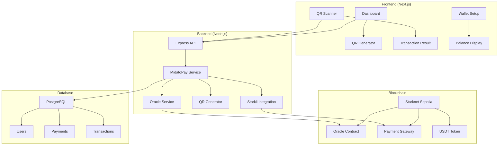

#  MidatoPay - Web3 Payment Solution for Merchants


**The first merchant wallet that allows charging with interoperable QR and receiving payments directly in cryptocurrencies**


## 📋 Table of Contents

- [🎯 Project Description](#-project-description)
- [✨ Key Features](#-key-features)
- [🏗️ System Architecture](#️-system-architecture)
- [🔧 Technologies Used](#-technologies-used)
- [📦 Installation and Configuration](#-installation-and-configuration)
- [🚀 Complete User Flow](#-complete-user-flow)
- [💎 Cairo Contracts](#-cairo-contracts)
- [🔗 Starknet Integration](#-starknet-integration)
- [📱 API Endpoints](#-api-endpoints)
- [🎨 Frontend Features](#-frontend-features)
- [🔐 Security](#-security)
- [📊 Database](#-database)
- [🧪 Testing](#-testing)
- [🚀 Deployment](#-deployment)
- [👥 Team](#-team)
- [📄 License](#-license)

## 🎯 Project Description

MidatoPay is a revolutionary Web3 payment solution designed specifically for Argentine merchants seeking protection from inflation. The platform allows merchants to receive payments in cryptocurrencies (USDT, BTC, ETH) through interoperable QR codes, while maintaining the simplicity of traditional payments.

### 🎪 Problem it Solves

- **Argentine Inflation**: Merchants lose value of their income due to inflation
- **Entry Barriers**: Existing crypto solutions are complex for traditional merchants
- **Interoperability**: Lack of interoperable QR standards in the crypto ecosystem
- **Currency Conversion**: Difficulty converting ARS to crypto efficiently

### 💡 Proposed Solution

MidatoPay offers a complete platform that includes:
- Automatic wallet for merchants
- Interoperable QR codes with EMVCo TLV standard
- Real-time price oracle (ARS ↔ USDT)
- Direct integration with Starknet
- Simple and familiar interface

## ✨ Key Features

### 🛡️ Inflation Protection
- Automatic ARS → USDT conversion using Starknet Oracle
- Real-time prices updated every 30 seconds
- Protection of merchant income value

### ⚡ Instant Transactions
- Direct integration with Starknet L2
- Fast confirmations (< 2 minutes)
- Minimal gas fees compared to Ethereum

### 🔗 Interoperable QR
- EMVCo TLV standard implemented
- Compatible with any wallet that supports the standard
- Structured data: merchant address, amount, payment ID

### 🎯 Simplified User Experience
- Intuitive dashboard for merchants
- QR generation with one click
- Easy scanning from any device
- Real-time notifications

## 🏗️ System Architecture



## 🔧 Technologies Used

### Frontend
- **Next.js 14** - React framework with App Router
- **TypeScript** - Static typing
- **Tailwind CSS** - Utility styles
- **Framer Motion** - Animations
- **React Hook Form** - Form handling
- **React Toastify** - Notifications

### Backend
- **Node.js** - JavaScript runtime
- **Express.js** - Web framework
- **Prisma** - Database ORM
- **WebSocket** - Real-time communication
- **Starkli** - CLI for Starknet

### Blockchain
- **Starknet Sepolia** - Test network
- **Cairo** - Smart contract language
- **OpenZeppelin** - Contract libraries

### Database
- **PostgreSQL** - Relational database
- **Prisma Migrate** - Schema migrations

## 📦 Installation and Configuration

### Prerequisites
- Node.js 18+
- PostgreSQL 15+
- Git
- Starkli CLI


## 🚀 Complete User Flow

### 1. 🏠 Homepage
- Landing page with product information
- Call-to-action for registration
- Statistics and key features

### 2. 🔐 Registration and Login
- **Registration**: Email, name, phone
- **Login**: JWT authentication
- **Roles**: MERCHANT, ADMIN

### 3. 💼 Merchant Dashboard
- **Overview**: Sales statistics
- **USDT Balance**: Current real-time balance
- **History**: Recent transactions

### 4. 🔑 Wallet Setup
- **Generate Wallet**: Automatic Starknet wallet creation
- **Import Wallet**: Use existing wallet
- **Verify Balance**: Connection with USDT contract
- **Security**: Private key encryption

### 5. 💰 Payment Management
- **Add Amount**: ARS quantity input
- **Automatic Conversion**: Oracle ARS → USDT
- **Generate QR**: Interoperable QR code
- **Share**: QR link or image

### 6. 📱 QR Scanning
- **Camera**: Automatic QR scanning
- **Validation**: EMVCo TLV data verification
- **Processing**: Starknet transaction execution
- **Confirmation**: Hash and link to Starkscan

### 7. ✅ Transaction Result
- **Status**: Pending → Completed
- **Hash**: Link to blockchain explorer
- **Details**: Amount, merchant, timestamp
- **Actions**: Copy hash, scan another QR

## 💎 Cairo Contracts

### Price Oracle (`starknetOracleService.js`)
```cairo
#[contract]
mod PriceOracle {
    use starknet::ContractAddress;
    use starknet::get_caller_address;
    
    #[storage]
    struct Storage {
        scale: u256,
        price_feed: ContractAddress,
    }
    
    #[external(v0)]
    fn quote_ars_to_usdt(ref self: ContractState, amount_ars: u256) -> u256 {
        // Oracle implementation
        let scaled_amount = amount_ars * self.scale.read();
        // ARS → USDT conversion logic
    }
}
```

### Payment Gateway (`payment_gateway.cairo`)
```cairo
#[contract]
mod PaymentGateway {
    use starknet::ContractAddress;
    use starknet::get_caller_address;
    
    #[storage]
    struct Storage {
        admin: ContractAddress,
        usdt_token: ContractAddress,
    }
    
    #[external(v0)]
    fn pay(
        ref self: ContractState,
        merchant_address: ContractAddress,
        amount: u256,
        token_address: ContractAddress,
        payment_id: felt252
    ) {
        // Transfer USDT to merchant
        // Register transaction
        // Emit event
    }
}
```

### Contract Features
- **Gas Optimized**: Efficient use of storage and compute
- **Security**: Validations and security checks
- **Scalability**: Designed for high transaction volume
- **Interoperability**: Compatible with ERC-20 standards

## 🔗 Starknet Integration

### Starkli CLI Integration
```javascript
```javascript
// Automatic transaction execution
const command = `starkli invoke ${contractAddress} pay ${merchantAddress} u256:${amount} ${tokenAddress} ${paymentId} --account ${accountPath} --keystore ${keystorePath} --keystore-password ${password} --network sepolia`;

const { stdout, stderr } = await execAsync(command, {
  timeout: 60000
});
```

### Integration Features
- **Automatic Transactions**: Execution without manual intervention
- **Error Handling**: Automatic error recovery
- **Dry-run**: Validation before real execution
- **Hash Extraction**: Automatic transaction hash extraction

### Supported Networks
- **Starknet Sepolia**: Test network (current)
- **Starknet Mainnet**: Production (future)

## 📱 API Endpoints

### Authentication
```http
POST /api/auth/register
POST /api/auth/login
POST /api/auth/logout
```

### User
```http
GET /api/users/profile
PUT /api/users/profile
POST /api/users/wallet/generate
POST /api/users/wallet/import
```

### Payments
```http
POST /api/midatopay/generate-qr
POST /api/midatopay/scan-qr
GET /api/midatopay/history/:merchantId
GET /api/midatopay/stats/:merchantId
```

### Oracle
```http
GET /api/oracle/price/ars-usdt
GET /api/oracle/quote/:amount
```

### WebSocket
```javascript
// Real-time connection
const ws = new WebSocket('ws://localhost:3001/ws');
ws.onmessage = (event) => {
  const data = JSON.parse(event.data);
  // Update UI in real-time
};
```

## 🎨 Frontend Features

### Main Components
- **Dashboard**: Main merchant view
- **QRModal**: QR generation and display
- **WalletSetup**: Wallet configuration
- **TransactionResult**: Transaction results
- **CustomHeader**: Custom navigation

### Custom Hooks
- **useOracleConversion**: ARS → USDT conversion
- **useWebSocket**: Real-time communication
- **useWalletManager**: Wallet management

### Responsive Design
- **Mobile First**: Design optimized for mobile devices
- **Tablet**: Adaptation for tablets
- **Desktop**: Complete desktop experience

## 🔐 Security

### Encryption
- **Private Keys**: Encrypted with AES-256
- **JWT Tokens**: Signed with secure secret
- **HTTPS**: Encrypted communication

### Validations
- **Input Validation**: Input sanitization
- **Rate Limiting**: Protection against spam
- **CORS**: Allowed domains configuration

### Database
- **Prisma**: ORM with SQL injection protection
- **Migrations**: Schema version control
- **Backups**: Automatic backups

## 📊 Database

### Main Schema
```sql
-- Users (Merchants)
CREATE TABLE users (
  id TEXT PRIMARY KEY,
  email TEXT UNIQUE NOT NULL,
  password TEXT NOT NULL,
  name TEXT NOT NULL,
  phone TEXT,
  walletAddress TEXT,
  privateKey TEXT,
  publicKey TEXT,
  walletCreatedAt TIMESTAMP,
  role TEXT DEFAULT 'MERCHANT',
  isActive BOOLEAN DEFAULT true,
  createdAt TIMESTAMP DEFAULT NOW(),
  updatedAt TIMESTAMP DEFAULT NOW()
);

-- Payments
CREATE TABLE payments (
  id TEXT PRIMARY KEY,
  amount DECIMAL(18,8) NOT NULL,
  currency TEXT DEFAULT 'ARS',
  concept TEXT,
  orderId TEXT UNIQUE NOT NULL,
  status TEXT DEFAULT 'PENDING',
  qrCode TEXT UNIQUE NOT NULL,
  expiresAt TIMESTAMP NOT NULL,
  userId TEXT REFERENCES users(id),
  createdAt TIMESTAMP DEFAULT NOW(),
  updatedAt TIMESTAMP DEFAULT NOW()
);

-- Blockchain Transactions
CREATE TABLE transactions (
  id TEXT PRIMARY KEY,
  paymentId BIGINT NOT NULL,
  paymentIdString TEXT REFERENCES payments(id),
  amount DECIMAL(18,8) NOT NULL,
  currency TEXT NOT NULL,
  exchangeRate DECIMAL(18,8),
  finalAmount DECIMAL(10,2),
  finalCurrency TEXT DEFAULT 'ARS',
  status TEXT DEFAULT 'PENDING',
  blockchainTxHash TEXT,
  walletAddress TEXT,
  confirmationCount INTEGER DEFAULT 0,
  requiredConfirmations INTEGER DEFAULT 1,
  userId TEXT REFERENCES users(id),
  createdAt TIMESTAMP DEFAULT NOW(),
  updatedAt TIMESTAMP DEFAULT NOW()
);
```

### Developers
- **Frontend**: Next.js, React, TypeScript
- **Backend**: Node.js, Express, Prisma
- **Blockchain**: Cairo, Starknet, Starkli
- **DevOps**: Docker, CI/CD, Deployment


---


**🚀 MidatoPay - Protecting merchants from inflation with Web3 technology**


